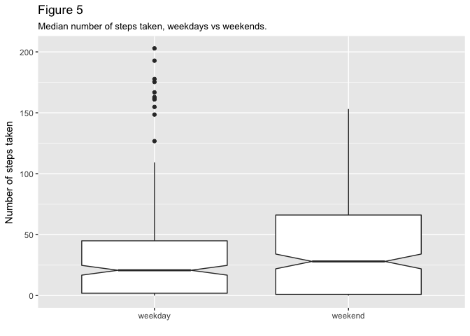

## Loading and preprocessing the data

This assignment makes use of data from a personal activity monitoring device. The device collects data at 5 minute intervals throughout the day. Two months of data from an anonymous individual were collected during the months of October and November, 2012 and include the number of steps taken in 5 minute intervals each day.^[As described in the instructions for this assignment.]

We use the [readr](http://readr.tidyverse.org/) function `read_csv()` to read the raw data into a data frame (actually, a [tibble](http://tibble.tidyverse.org/)) named `activity`. The `read_csv()` function allows the data format of each column to be specified at the time the data are read. We initially read in the `interval` variable as a factor, because later we need to compute the mean number of steps by interval, but will eventually plot `interval` as a numeric value. Next, using the [dplyr](http://dplyr.tidyverse.org/) and [lubridate](http://lubridate.tidyverse.org/) packages, we format the string date column as a date variable and then use the `date` variable to create new variables for the day of the week (`weekday`) and the month (`month`). We then create a new factor variable called `workweek` with two levels, "weekday" and "weekend," indicating whether a given date is a weekday or weekend day. We then re-order the variables to better reflect the structure of the data, and finally drop unused factor categories using the base R function `droplevels()`.  


```r
activity <- read_csv("activity.csv", col_names = TRUE, col_types = cols(steps = col_integer(), 
            date = col_character(), interval = col_factor(levels = NULL))) %>% 
    mutate(date = ymd(date)) %>% 
    mutate(weekday = wday(date, label = TRUE, abbr = FALSE)) %>% 
    mutate(month = month(date, label = TRUE, abbr = FALSE)) %>%
    mutate(workweek = case_when(
            weekday == "Saturday" | weekday == "Sunday" ~ "weekend",
            TRUE                      ~  "weekday"
    )) %>% 
    mutate(workweek = as.factor(workweek)) %>% 
    select(date, month, weekday, workweek, interval, steps) %>% 
    droplevels()

attach(activity)
```

## What is the mean total number of steps taken per day? {#link1}

We sum the number of steps taken by the variable `date`, each of which corresponds to a single day. There are 61 dates in the dataset, which is the total number of days in October and November.


```r
steps <- activity %>% 
    group_by(date) %>% 
    summarise(sum(steps))

mean_steps <- mean(steps$`sum(steps)`, na.rm = TRUE)
median_steps <- median(steps$`sum(steps)`, na.rm = TRUE)

hist(steps$`sum(steps)`, breaks = 61, xlab = "Total steps per day", main = "Figure 1")
```


The mean total number of steps taken per day is 10,766, and the median total number of steps taken per day is 10,765. The fact that the mean and median are almost equal indicates that the distribution of the total number of steps taken per day (Figure 1) is more or less symmetric, and is centered on approximately 10,000 total steps per day. 

## What is the average daily activity pattern?

For each of the 61 dates, there are 288 five-minute intervals. For each interval, the number of steps taken in that interval was recorded. We thus group the data by `interval` (a factor) and compute the mean number of steps by `interval`, excluding missing values. This summarizes the data for each interval across all days. We save the summarized data in the new data frame `mean_steps_interval`.

To create Figure 2, a time series plot, we convert the factor variable `interval` to numeric values for plotting on the x-axis.


```r
mean_steps_interval <- activity %>% 
    group_by(interval) %>% 
    summarise(mean = mean(steps, na.rm = TRUE), n = n()) 

plot(as.numeric(mean_steps_interval$interval), mean_steps_interval$mean, type="l", 
     main = "Figure 2", xlab = "5-minute interval (24-hour time)", ylab = "Mean number of steps taken", xaxt="n")
axis(1, at=as.numeric(mean_steps_interval$interval), labels=mean_steps_interval$interval)
abline(v = mean_steps_interval[[which.max(mean_steps_interval$mean), 'interval']], lty = 5)
```


From Figure 2 it is seen that the interval containing the maximum number of steps is 835. This corresponds to the maximum average number of steps taken, 206, as shown by the dashed vertical line in Figure 2.

## Imputing missing values


```r
# Calculations to support in-line R code.
complete_cases <- complete.cases(activity)
missing <- summary(complete_cases)["FALSE"]
```

Using the [complete.cases](https://stat.ethz.ch/R-manual/R-devel/library/stats/html/complete.cases.html) function, we find that there are 2,304 rows, or five-minute intervals, in the `activity` data frame that contain missing values (NAs). This is 13 percent of the data. There are 11,014 rows in which `steps` is equal to zero, that is, when the subject did not take any steps. This is 63 percent of the data. Finally, there are 4,250 rows in which the `steps` variable is greater than zero, that is, when the subject actually moved. This comprises 24 percent of the data.

This leads us to adopt a very simple strategy for imputing missing values. We will replace all NAs with zero, because much of the data already contain zeroes. 

As a check, the sum of the number of rows containing NAs plus the number of rows in which `steps` = 0 plus the number of rows where `steps` > 0 should equal the total number of rows in the `activity` data frame, which is 17,568.

The R code to conduct this check is:

`as.numeric(missing[[1]]) + sum(activity$steps == 0, na.rm = TRUE) + sum(activity$steps > 0, na.rm = TRUE)`

and when we run said code, we get 17,568, the total number of rows in the `activity` data frame.

We next compute a new data frame, named `activity_No_NA`, that is equal to the original data frame `activity` but with the missing data filled in with zeroes as just described. We then repeat the analysis for [What is the mean total number of steps taken per day?](#link1) using the `activity_No_NA` data frame, which now contains zeros in place of NA values.


```r
activity_No_NA <- activity
activity_No_NA$steps[is.na(activity_No_NA$steps)] <- 0

steps_No_NA <- activity_No_NA %>% 
    group_by(date) %>% 
    summarise(sum(steps))

mean_steps_No_NA <- mean(steps_No_NA$`sum(steps)`, na.rm = TRUE)
median_steps_No_NA <- median(steps_No_NA$`sum(steps)`, na.rm = TRUE)

hist(steps_No_NA$`sum(steps)`, breaks = 61, xlab = "Total steps per day (NAs replaced by 0)", main = "Figure 3")
```


By changing NA values of `steps` to zero, we only added eight additional days where the total number of steps taken per day was equal to zero. If the zero days are ignored, the main shapes of the two histograms remain unchanged (Figures 1 and 3).

When NA values were replaced with zeroes, the mean total number of steps taken per day declined from 10,766 to 9,354, or 13%. The median total number of steps taken per day, however, only declined from 10,765 to 10,395, or 3%.

As is [well known](https://en.wikipedia.org/wiki/Median), the median is far less sensitive to outliers than is the mean.

The moral of this story is: If your data are skewed, use the median, not the mean.

## Are there differences in activity patterns between weekdays and weekends?

Figure 4 contains time series plots of the the mean number of steps taken in each 5-minute interval over 24 hours, averaged across all weekdays or weekend days. The peak number of steps taken on weekends is approximately 150, centered around the 9:00 am time interval. On weekdays the peak number of steps was higher, at around 200, and occurred slightly earlier in the morning.

Figure 5 is a boxplot of the number of steps taken per time interval for weekdays vs weekends. Overall, there were slightly more steps taken on weekend days, but there were more extreme values for steps taken on weekdays, suggesting that the subject had more bouts of greater activity during the work week than on weekends.


```r
mean_steps_interval_workweek <- activity_No_NA %>%
    group_by(workweek, interval) %>%
    summarise(mean = mean(steps, na.rm = TRUE), n = n())

p <- ggplot(mean_steps_interval_workweek, aes(interval, mean, group=1)) +
    geom_line() +
    facet_grid(workweek ~ .) +
    scale_x_discrete("5-minute interval (24-hour time)",
        breaks=c("0", "130", "325", "520", "715", "910", "1115", "1335", "1555", "1815", "2035", "2255"),
        labels=c("00:00", "01:30", "03:25", "05:20", "07:15", "09:10", "11:15", "13:35", "15:55", "18:15", "20:35", "22:55")) +
        ylab("Mean number of steps taken") +
        ggtitle("Figure 4", subtitle = "Steps taken over 24 hours, weekdays vs weekends.")
p
```


```r
f5 <- ggplot(mean_steps_interval_workweek, aes(workweek, mean)) +
    geom_boxplot(notch = TRUE) +
    ylab("Number of steps taken") + xlab("") +
    ggtitle("Figure 5", subtitle = "Median number of steps taken, weekdays vs weekends.")

f5
```




